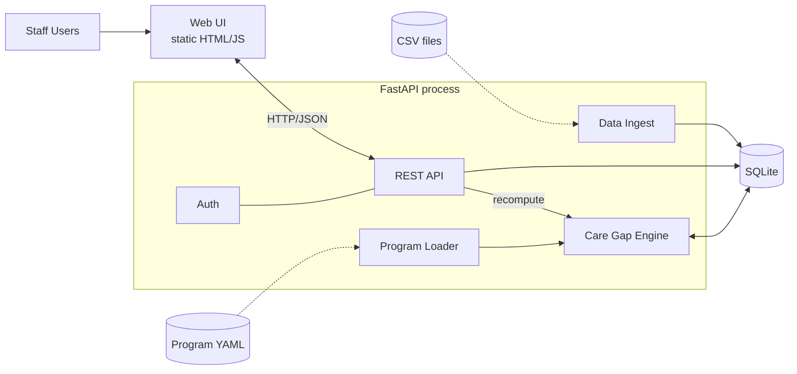

# Architecture — Lean MVP (`main`)

A care-gap worklist that finds patients who are overdue for a specialty visit
under a care program (diabetes, primary-care wellness) and turns each gap into
a task that front-desk and clinical staff can claim, complete or decline.

This branch is deliberately small: **one process, one SQLite file, no message
bus, no cache.** The sibling branch `feature/scaled` holds the
production-shaped version (separate services, MySQL, Kafka, Redis) — see
[its architecture doc](https://github.com/FuriousApe/eCares/blob/feature/scaled/docs/ARCHITECTURE.md)
for the comparison.

Diagram: [`architecture.drawio`](architecture.drawio) (open in draw.io / diagrams.net).



## 1. Components

| Component | Code | Responsibility |
|---|---|---|
| Web UI | `static/` | Plain HTML/JS/CSS served by FastAPI itself. Login picker, worklist table, claim / complete / decline actions. No build step. |
| REST API | `app/routers/` | `auth`, `patients`, `tasks`, `admin`. All under `/api`. Thin: validate, check role, read/write DB, write audit row. |
| Auth | `app/auth.py`, `routers/auth.py` | Demo login: pick a seeded user, receive an HMAC-signed cookie carrying the user id. Maps role → allowed task types. |
| Ingest | `app/ingest.py` | One-time CSV load into SQLite on first startup. |
| Program Loader | `app/engine/program_loader.py` | Parses `programs/*.yaml` into in-memory rule objects. |
| Evaluator | `app/engine/evaluator.py` | **Pure function**: patient snapshot + programs + as-of date → eligibility, tier and per-specialty needs. No I/O. |
| Recompute | `app/engine/recompute.py` | The I/O wrapper: loads facts, calls the evaluator, diffs the result against existing tasks, writes tasks / enrollments / audit rows in one transaction. |
| Storage | `app/models.py`, `app/db.py` | SQLAlchemy models over a single SQLite file (`app.db`). |

## 2. Startup sequence

`app/main.py` runs this in the FastAPI lifespan hook:

1. `Base.metadata.create_all` — create tables if missing (no migrations).
2. If `patients` is empty: ingest the four CSVs, seed two demo users, then run
   `recompute_all` once.
3. Mount the API under `/api` and the static UI at `/`.

Restarting with an existing `app.db` skips step 2, so task state survives.
Delete `app.db` to reset to a clean load.

## 3. The rules engine

### Programs are data, not code

Each YAML file in `programs/` declares eligibility, an optional tier signal,
and tiers with a per-specialty visit cadence (days):

```yaml
program_id: diabetes_management
eligibility: {any_diagnosis_prefix: [E10, E11]}
tier_signal: {lab: HbA1c, window_months: 6}
tiers:
  - {name: high_risk, when: {gte: 9.0}, needs: {Endocrinology: 90, ...}}
```

Adding a program means adding a YAML file — the evaluator's condition grammar
(`min_age`, `diagnosis_prefix`, `any`, `gte`/`lt`, `no_result`, `default`) is
already generic.

### Evaluation per patient and program

1. **Eligible?** If not, the patient has no enrollment and any open tasks for
   that program are closed (`not_eligible`).
2. **Tier** — the first tier whose condition matches (lab value in window, or
   age/diagnosis rules). The tier picks the set of needed specialties and
   cadences.
3. **Per-specialty need** (`_evaluate_need`):

| Situation | Decision |
|---|---|
| Upcoming (future) encounter exists | `no_task` (`upcoming_visit`) |
| No past visit, specialty is primary care (`PCP`) | `no_task` |
| No past visit, any other specialty | `referral` |
| Past visit, gap since last visit **>** cadence | `scheduling` (due date = last visit + cadence) |
| Past visit, gap ≤ cadence | `no_task` |

The overdue comparison is strictly greater-than: a patient exactly at the
cadence boundary is not yet overdue.

### Recompute diff (`recompute_all`)

The engine is a **full-population sweep** on every call (about 300 patients, so
it takes milliseconds). For each patient and program it reconciles desired
state against existing tasks:

- No open task and a need exists → create a task + audit row.
- Open task, same decision → leave it alone (no churn).
- Open task, decision changed → close as `tier_changed`, open the new one.
- Open task, need vanished → close (`visit_found` / `upcoming_visit` / `tier_changed` / `not_eligible`).
- Latest task is `declined` and still inside `snooze_until` → do not recreate.
- Latest task is `completed` for the same due date → do not recreate.

`as_of_date` defaults to **2026-04-08**, matching the era of the CSV data
(there is no meaningful "today" for a static extract).

## 4. Task lifecycle

```
open ──claim──▶ in_progress ──complete──▶ completed
  │                 │
  │                 └──decline (+ snooze)──▶ declined
  └── engine close (any time) ──▶ closed
```

| Endpoint | Rule |
|---|---|
| `POST /api/patients/{id}/claim` | Moves the patient's visible open tasks to `in_progress`, assigned to the caller. |
| `POST /api/tasks/{id}/complete` | Caller must hold the claim. Sets `completed` + a resolution. |
| `POST /api/tasks/{id}/decline` | Caller must hold the claim. Sets `declined`, stores a reason, sets `snooze_until = as_of + snooze_days`. |
| `POST /api/admin/recompute` | Re-runs the full sweep. |

A **partial unique index** (`uq_one_open_task` on patient, program, specialty
where status is `open` or `in_progress`) makes the database itself refuse a
second live task for the same gap, independent of application logic.

## 5. Roles and visibility

| Role | Demo user | Sees |
|---|---|---|
| `scheduler` | Jordan (Front Desk) | `scheduling` tasks |
| `clinical` | Dr. Patel (Clinical) | `scheduling` and `referral` tasks |

Every list endpoint filters by the caller's allowed task types in the query.
Mutations re-check the type and claim ownership.

## 6. Data model

Eight tables in one SQLite file:

- **Facts** (from CSV): `patients`, `diagnoses`, `labs`, `encounters`
- **Derived**: `enrollments` (current tier per patient/program), `tasks`
- **Access & history**: `users`, `audit_log` (append-only; one row per state
  change, written in the same transaction)

There is no `programs`, `needs`, `row_hash`, staging or outbox table here — see
below for why.

## 7. What was cut, and when it breaks

| Choice | Why it is fine now | Breaks when |
|---|---|---|
| Full recompute of every patient | ~300 patients, static data | Roughly tens of thousands of patients, or live data — needs per-patient scheduling and event triggers. |
| Programs read from YAML at recompute | Nothing else reads them | You need versioning, activation, or admin edits without redeploy. |
| SQLite, single process | One writer, local demo | Multiple app instances or concurrent writers. |
| No cache | Tiny reads | Large paginated worklists under load. |
| Demo login, no passwords | Assessment allows a role switch | Any real deployment. Replace with real identity + RBAC. |
| N+1-style per-patient queries in list endpoints | Trivial at this size | Worklist has to be paged in SQL. |
| No idempotency key on evaluation | Recompute is naturally re-runnable | Concurrent triggers per patient. |

The `feature/scaled` branch addresses each row of this table.

## 8. Running and testing

```bash
pip install -r requirements.txt
PYTHONPATH=. uvicorn app.main:app --port 8000     # http://localhost:8000, docs at /docs
```

See the top-level `README.md` for demo logins.
