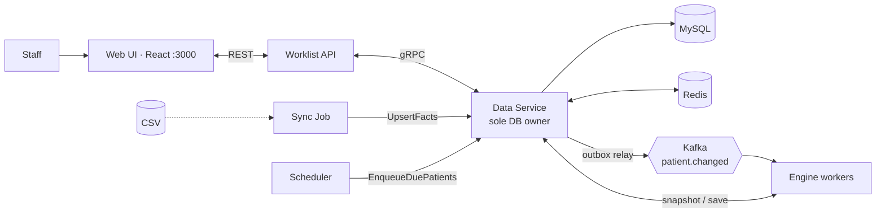

# Architecture — Scaled Build (`feature/scaled`)

The production-shaped version of the care-gap engine, designed for roughly
**1M patients and thousands of care programs**. It finds patients overdue for
a specialty visit, creates one task per gap, and keeps those tasks correct as
patient data changes.

Diagrams:
[`ecares_scaled_architecture_complete.drawio`](ecares_scaled_architecture_complete.drawio) (full system view: gateway, identity provider, container platform) ·
[`architecture.drawio`](architecture.drawio) (service-level view) ·
[`database-schema.drawio`](database-schema.drawio)
(open in draw.io / diagrams.net). Table-level detail: [`DATABASE.md`](DATABASE.md).

The simpler single-process version lives on `main`; each design choice below
notes what it replaces.



## 1. Design principles

1. **One component owns the database.** Only the Data Service holds MySQL
   credentials. Every other service talks to it over a fixed gRPC contract
   (`proto/dataservice.proto`). Consistency rules — state transitions,
   uniqueness, audit, role filtering — live in exactly one place.
2. **The engine is stateless and pure.** It never touches the DB. It asks for
   a patient snapshot, computes, and sends back a result. That makes it
   trivially horizontally scalable and easy to test.
3. **Evaluate on change, not on a sweep.** Work is triggered per patient by an
   event (new data, a due date arriving), instead of re-checking everyone.
4. **Every mutation is atomic with its side effects.** Task change + audit row
   + outbox event commit in one transaction.
5. **Caches and queues are best-effort accelerators, never the source of
   truth.** If Redis is down, reads still work. If Kafka is down, events wait
   in the outbox.

## 2. Services

| Service | Path | Role | Scales by |
|---|---|---|---|
| **Web UI** | `services/ui` | React (Vite + TypeScript) single-page app for front desk and call center staff: worklist, patient panel, patient search, admin. Built to static files and served on `:3000`. | CDN / replicas |
| **Worklist API** | `services/worklist_api` | Public REST surface (FastAPI). Resolves the caller's role from `X-User-Role`, translates REST ⇄ gRPC, maps gRPC errors to HTTP status codes. Holds no state. | Replicas behind a load balancer |
| **Data Service** | `services/data_service` | gRPC server; the only DB client. Runs three logical roles selected by `DS_ROLES`: `interactive` (worklist reads/writes), `bulk` (sync + evaluation saves), `relay` (outbox → Kafka). | Split roles into separate deployments so bulk load cannot starve interactive traffic |
| **Engine** | `services/engine` | Kafka consumer group `engine`. For each `patient.changed` message: fetch snapshot → evaluate every active program → save result. Failed patients retry then go to a DLQ topic. | More replicas, up to the topic partition count (6) |
| **Scheduler** | `services/scheduler` | A timer loop. Every interval it calls `EnqueueDuePatients` so patients whose date-based triggers have arrived get re-evaluated. | Single instance |
| **Sync** | `services/sync` | Reads CSVs, maps them to canonical rows, streams 100-row chunks to `UpsertFacts` with retry/backoff. Run on demand or via `POST /admin/sync`. | Per-source jobs |
| **Migrate** | `migrations/` | Alembic schema migrations, run once before the Data Service starts. | — |

Infrastructure: **MySQL 8** (system of record), **Redis 7** (cache),
**Kafka** (event bus, KRaft mode, 6 partitions by default).

## 3. The gRPC contract

`DataService` groups RPCs by who calls them:

| Group | RPCs | Callers |
|---|---|---|
| Interactive read | `GetMeta`, `ListPatients`, `GetPatient`, `ListTasks`, `GetTask`, `ListPrograms` | Worklist API |
| Interactive write | `ClaimTask`, `CompleteTask`, `DeclineTask`, `SnoozeTask` | Worklist API |
| Bulk | `StartSyncRun`, `UpsertFacts`, `CompleteSyncRun`, `ListSyncRuns`, `UpsertPrograms`, `GetPatientSnapshot`, `SaveEvaluationResult`, `EnqueueDuePatients`, `EnqueueAllPatients` | Sync, Engine, Scheduler, Admin |

There is no RPC for the outbox relay; it is an internal loop.

**Error convention.** The Data Service sets trailing metadata `code`
(`not_found`, `version_conflict`, `illegal_transition`, `validation_error`); the
API maps these to 404 / 409 / 422 / 422. A task that exists but is hidden by the
caller's role returns `not_found`, never `403`, so existence is not leaked.

## 4. Data flows

### 4.1 Ingest (facts in)

1. `sync` reads a CSV, maps columns to canonical field names, drops malformed
   rows locally (counted, never sent).
2. It calls `StartSyncRun`, then `UpsertFacts` per 100-row chunk. A retried
   chunk keeps its `chunk_number`, so the staging write is delete-then-insert,
   never an append. Retries: 4 attempts, 1s/2s/4s backoff, only on
   `UNAVAILABLE`, `DEADLINE_EXCEEDED`, `RESOURCE_EXHAUSTED`.
3. The Data Service validates each row deeply (types, that the referenced
   patient exists). Rejects go to `sync_quarantine` with a reason.
4. `CompleteSyncRun` diffs `staging_rows` against the live tables by natural
   key and compares `row_hash` (sha256 of canonical values). Only genuinely
   changed rows are upserted.
5. In the same transaction it writes a `patient.changed` outbox event for each
   patient directly or indirectly touched.

### 4.2 Event delivery (transactional outbox)

Events are written to the `outbox` table inside the business transaction. The
`relay` loop publishes unpublished rows to Kafka keyed by `patient_id`
(so one patient's events stay ordered on one partition), marks them
`published_at`, and after `MAX_ATTEMPTS` failures routes the row to the DLQ
topic. This removes the classic dual-write bug: no committed change is ever
lost because Kafka was down, and no event is published for a rolled-back change.

### 4.3 Evaluation

1. Engine consumes `patient.changed`.
2. `GetPatientSnapshot` returns facts + a `snapshot_hash`; active programs come
   from `ListPrograms` (served from the `programs:active` cache).
3. The evaluator computes eligibility → tier → per-specialty needs for each
   program, and a candidate `next_eval_at`.
4. `SaveEvaluationResult` sends the result with an **idempotency key**
   `sha256(patient_id : snapshot_hash)`. If it equals
   `patient_eval_state.last_idempotency_key`, nothing is written
   (`applied=false`) — safe under Kafka redelivery.
5. Otherwise the Data Service, in one transaction: upserts enrollments and
   needs, reconciles tasks (create / retarget / close), writes audit + outbox
   rows, and sets `next_eval_at`.
6. Failures retry; a poison patient goes to the DLQ instead of blocking the
   partition.

### 4.4 Time-driven re-evaluation

Some gaps appear because time passed, not because data changed. The evaluator
returns the earliest future date that could change the outcome (a cadence
deadline, a tier re-check, a snooze expiring). The Data Service stores the
minimum of those and any snooze expiry (+1 day) in
`patient_eval_state.next_eval_at`. The scheduler's `EnqueueDuePatients` picks
up rows whose `next_eval_at` has passed (via the `ix_eval_state_next_eval_at`
index) and emits `patient.changed { reason: "due_recheck" }`. Cost per tick is
proportional to *due* patients, not to the population.
`EnqueueAllPatients` exists for a full re-evaluation (e.g. after a program
change); engine replicas can be scaled out to drain it.

### 4.5 Worklist read and cache

`ListTasks` / `ListPatients` use **keyset pagination** (stable cursor, default
limit 50, max 200) and apply the role filter in SQL. Results are cached in
Redis as `worklist:{generation}:{query-hash}`. Any task change bumps a single
`worklist:generation` counter, which invalidates every cached page at once
without scanning keys. `GetPatient` is never cached. All Redis calls are
wrapped: an outage degrades latency, not correctness.

## 5. Task model and concurrency

```
open ──claim──▶ in_progress ──complete──▶ completed
  ▲                 │  └──decline (+snooze_until)──▶ declined
  └────snooze───────┘
open / in_progress ──engine close──▶ closed
```

The transition table is a pure function (`task_state.py`); anything not listed
raises `illegal_transition`.

| Guard | Mechanism |
|---|---|
| One live task per (patient, program, specialty) | Generated column `open_key` (non-null only for `open`/`in_progress`) with a `UNIQUE` index — enforced by MySQL, not app code. |
| Lost updates on the same task | Optimistic locking: every mutation sends the task `version`; a stale value → `version_conflict` → HTTP 409. |
| Concurrent evaluations of one patient | `SELECT … FOR UPDATE` on the patient's eval-state row plus the idempotency key. |
| Task flapping | **Hysteresis**: an open task's `due_date` is only retargeted if the recomputed date has moved by more than 60 days, so a one-day data correction does not churn the worklist. |
| Snoozed / handled gaps | A declined task inside `snooze_until`, or a completed task for the same due date, suppresses recreation. |

Resolutions recorded on completion or closure: `booked`, `referral_approved`,
`referral_not_indicated`, `visit_found`, `upcoming_visit`, `tier_changed`,
`not_eligible`. When several could apply on a close, a referral task closes as
`visit_found` if the specialty has any visit; otherwise an upcoming visit beats
a tier change, which beats `not_eligible`.

## 6. Programs as data

Program definitions (YAML in `seeds/programs/`) are parsed by the engine and
persisted through `UpsertPrograms` into the `programs` table keyed by
`(program_id, version)`. The engine reads active versions back from the Data
Service, not from files, so a program can be deactivated or superseded with no
code change or redeploy. Tasks and enrollments record the `program_version`
that produced them.

## 7. Security and roles

- The API maps `X-User-Role` to allowed task types (`scheduler` →
  `scheduling`; `clinical` / `admin` → `scheduling` + `referral`).
- The Data Service applies that list in the SQL `WHERE` clause, never by
  post-filtering, so a disallowed filter returns an empty page.
- `request_id` is generated at the edge, propagated over gRPC metadata
  (`x-request-id`), included in JSON logs and stored on every `audit_events` row.
- Auth here is a role header for the assessment. In production, put real
  identity (OIDC) in front of the API and derive the role from claims.

## 8. Observability and audit

- Structured JSON logs with `request_id` across all services.
- `audit_events` — append-only; each row holds actor, action, entity, before /
  after JSON, request id and result, written in the same transaction as the
  change.
- `sync_runs` and `sync_quarantine` give a ledger and a reject queue for every
  ingest.
- `GET /health` on the API; the Compose file wires health checks and start
  ordering (`migrate` → `data-service` → the rest).

## 9. Scaling notes

| Pressure | Lever |
|---|---|
| Worklist read load | API replicas; Redis page cache; keyset pagination; role-filtered index `ix_worklist(status, task_type, specialty, due_date)` |
| Evaluation throughput | `docker compose up --scale engine=N` (N ≤ partitions); each patient is one keyed message |
| Ingest bursts | `bulk` role isolated from `interactive`; chunked, retryable, idempotent upserts |
| Program-count growth | Definitions are data; engine evaluates the active set from cache |
| DB growth | Indexes on hot paths; staging rows are transient and prunable; audit and outbox are candidates for partitioning/archival |

## 10. Known limits

- `POST /admin/evaluate?patient_id=X` re-enqueues all currently-due patients,
  not just X (needs a single-patient RPC).
- `ListTasksRequest.sort` is accepted but not wired to alternate cursor order.
- The "20 parallel saves for one patient → one open task" guarantee relies on
  MySQL row locking; the unit tests run on SQLite, so it must be verified
  against the live Compose stack.
- Single Kafka broker and single MySQL instance in Compose; production would
  add replication and managed services.

## 11. Running it

```bash
make up          # Compose: mysql, redis, kafka, migrate, data-service, worklist-api, engine, scheduler, ui
make seed        # run the sync job against ./data
make test
```

API on `:8000`, UI on `:3000`. Design decisions and assumptions are logged in
`CLAUDE.md`, with per-service detail in `services/*/ASSUMPTIONS.md`.
